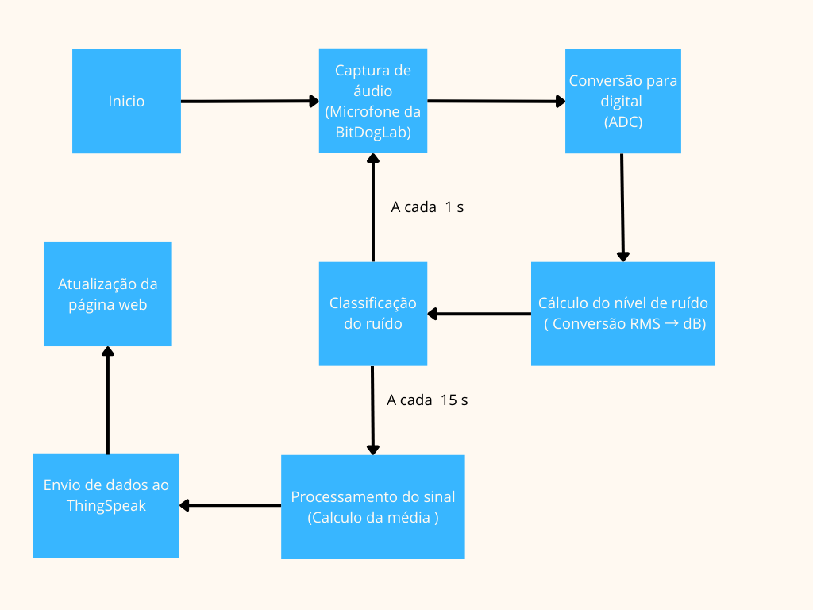

# 🛠️ NoiseGuard - Monitoramento de Ruído em Ambientes Acadêmicos  

## 📌 Sobre o Projeto  
O **NoiseGuard** é um sistema embarcado desenvolvido para monitorar os níveis de ruído em ambientes acadêmicos, como bibliotecas e salas de estudo. Ele detecta sons ambiente, processa os dados e fornece feedback visual e sonoro para incentivar a manutenção do silêncio.  

O sistema utiliza a **placa BitDogLab**, sensores e atuadores para fornecer alertas dinâmicos. Além disso, os dados são enviados para a plataforma **ThingSpeak** para monitoramento remoto e exibidos em uma interface web interativa.  

---

## 🛠️ Tecnologias e Componentes Utilizados  
- **Placa**: BitDogLab  
- **Sensores**: Microfone integrado  
- **Atuadores**: Matriz de LEDs RGB, Display OLED e Buzzer  
- **Comunicação**: Wi-Fi (CYW43) e protocolo HTTP  
- **Plataforma IoT**: ThingSpeak (para armazenamento e visualização de dados)  
- **Interface Web**: HTML, CSS, JavaScript (com gráficos dinâmicos via API do ThingSpeak)  
- **Linguagem**: C (para desenvolvimento embarcado)  

---

O fluxo de funcionamento do NoiseGuard pode ser representado pelo seguinte fluxograma:



---

## 📂 Estrutura do Projeto  

```
📦 NoiseGuard
 ┣ 📂 inc                  
 ┃ ┣ 📜 adc_dma.h           # Manipulação do ADC com DMA
 ┃ ┣ 📜 buzzer_led.h        # Controle dos LEDs e buzzer
 ┃ ┣ 📜 display.h           # Interface com o display OLED
 ┃ ┣ 📜 ssd1306.h           # Driver para o display SSD1306
 ┃ ┣ 📜 ssd1306_font.h      # Biblioteca de fontes para o display
 ┃ ┣ 📜 ssd1306_i2c.h       # Comunicação I2C com o display
 ┃ ┣ 📜 thingspeak.h        # Comunicação com ThingSpeak
 ┃ ┣ 📜 wifi.h              # Gerenciamento da conexão Wi-Fi            
 ┃ ┣ 📜 adc_dma.c           # Implementação da leitura do microfone
 ┃ ┣ 📜 buzzer_led.c        # Controle dos LEDs e buzzer
 ┃ ┣ 📜 display.c           # Controle do display OLED
 ┃ ┣ 📜 ssd1306_i2c.c       # Comunicação I2C com o display
 ┃ ┣ 📜 thingspeak.c        # Envio de dados para ThingSpeak
 ┃ ┣ 📜 wifi.c              # Configuração do Wi-Fi
 ┣ 📜 NoiseGuard.c          # Código principal do projeto
 ┣ 📜 CMakeLists.txt        # Configuração do build (CMake)
 ┣ 📜 index.html            # Interface web para visualização dos dados
 ┣ 📜 lwipopts.h            # Configurações do protocolo TCP/IP
 ┣ 📜 ws2818b.pio           # Código para controle dos LEDs RGB
 ┣ 📜 favicon.ico           # Ícone da interface web
 ┗ 📜 README.md             # Documentação do projeto
```

---

## 🚀 Como Rodar o Projeto  

### 1️⃣ **Requisitos**  
- Placa **BitDogLab**  
- Ambiente de desenvolvimento **Pico SDK**  
- Conta no **ThingSpeak** para monitoramento

### 2️⃣ **Configuração e Compilação**  
```bash
# Clone o repositório
git clone https://github.com/seuusuario/NoiseGuard.git
cd NoiseGuard

# Compile o projeto (usando CMake)
mkdir build && cd build
cmake ..
make
```

### 3️⃣ **Carregar na Placa**
Após compilar, conecte a **BitDogLab** via USB e carregue o binário gerado no diretório `build`.

---

## 📸 Funcionamento  

### 🔹 **Classificação dos Níveis de Ruído**  
- **Ambiente Silencioso** (≤52 dB): LEDs Verdes.  
- **Ruído Moderado** (52 - 70 dB): LEDs Amarelos + alerta sonoro de 1s.  
- **Ruído Alto** (>70 dB): LEDs Vermelhos + mensagem visual de alerta.  

### 🔹 **Comunicação com a Nuvem**  
- Os dados são enviados a cada **15 segundos** para o **ThingSpeak** devido às restrições da versão gratuita.  
- O sistema calcula a **média móvel** das leituras para evitar falsos alarmes.  

### 🔹 **Interface Web**  
- Exibe os dados coletados em **tempo real**.  
- Inclui **alertas visuais e sonoros** para informar os usuários.  
- Hospedada no **GitHub Pages** → [Acesse aqui](https://diegonascimento2023.github.io/NoiseGuard/)  

---

## 📢 Demonstração  

📹 **Vídeo de apresentação**: [YouTube Link] *(Adicione o link do vídeo aqui)*  

🌍 **Interface Web (Monitoramento Online)**: [Clique aqui](https://diegonascimento2023.github.io/NoiseGuard/)  

📊 **Dados em Tempo Real (ThingSpeak)**: [Canal do ThingSpeak](https://thingspeak.mathworks.com/channels/2840125) 

---

## 📜 Licença  
Este projeto está licenciado sob a **MIT License**.  

---

## 📩 Contato  
📧 E-mail: *diego18nascimento10@gmail.com*  
📌 GitHub: [Diego Nascimento de Oliveira](https://github.com/diegonascimento2023/)  
